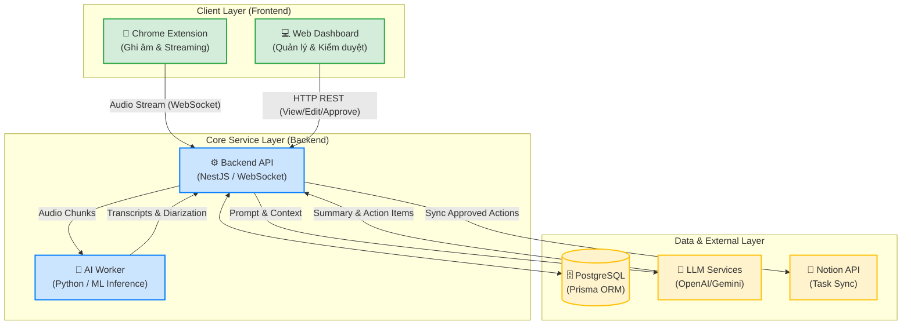

# BÁO CÁO TIẾN ĐỘ DỰ ÁN: KAPTER - AI MEETING ASSISTANT
**Nhóm 15 - VinAI**

## 1. Tổng quan dự án
Dự án **Kapter** là một trợ lý AI thông minh (AI Meeting Assistant) được thiết kế với mục tiêu tối ưu hóa quy trình làm việc và nâng cao năng suất cho các cá nhân và doanh nghiệp. Nền tảng này cho phép người dùng ghi âm các cuộc họp trực tuyến, tự động chuyển đổi giọng nói thành văn bản (Speech-to-Text), phân biệt người nói (Speaker Diarization), và sau đó sử dụng các mô hình ngôn ngữ lớn (LLM) để tóm tắt nội dung cuộc họp và tự động trích xuất các công việc cần thực hiện (Action Items).

Hệ thống đặc biệt chú trọng vào cơ chế **Human-in-the-loop** (Con người làm trung tâm kiểm duyệt), cho phép người dùng đánh giá, chỉnh sửa và phê duyệt trước khi các thông tin quan trọng được lưu trữ hoặc đồng bộ hóa sang các nền tảng quản lý công việc (như Notion), đảm bảo tính chính xác và bám sát nhu cầu thực tế của từng đội ngũ.

### 1.1. Kiến trúc hệ thống
Hệ thống Kapter được thiết kế theo kiến trúc Microservices hiện đại, tối ưu cho xử lý thời gian thực và các tác vụ tính toán AI nặng:

**Mô tả các thành phần chính:**
- **Capture Client (Chrome Extension):** Tiện ích trình duyệt chịu trách nhiệm capture âm thanh trực tiếp từ tab Google Meet và truyền dữ liệu thời gian thực (streaming) qua WebSocket.
- **Management Client (Web Dashboard):** Giao diện web trung tâm dành cho người dùng cuối (Next.js/React). Cung cấp không gian để review, chỉnh sửa Transcript, Summary, và Action Items.
- **Backend Orchestrator (API Server):** Máy chủ NestJS đóng vai trò điều phối trung tâm. Xử lý logic nghiệp vụ, quản lý kết nối WebSocket, tương tác với CSDL PostgreSQL và giao tiếp với các dịch vụ bên thứ ba.
- **Core AI Worker (Processing Engine):** Worker độc lập viết bằng Python, chuyên xử lý các tác vụ AI nặng (ASR bằng `faster-whisper` và Diarization bằng `pyannote.audio`), tận dụng tài nguyên phần cứng (GPU) hiệu quả.

### 1.2. Thông tin triển khai (Deployment)
- **Web Application:** [https://kapter.sondndev.id.vn/](https://kapter.sondndev.id.vn/) (Triển khai trên Vercel)
- **Backend API:** [https://kapter-api.sondndev.id.vn/api/docs](https://kapter-api.sondndev.id.vn/api/docs) (Triển khai trên Heroku)
- **AI Worker:** Self-hosted server, trang bị GPU để xử lý inference các model Deep Learning.
- **Architecture:** Monorepo sử dụng PNPM Workspaces để chia sẻ các types và thư viện dùng chung.

---

## 2. Tiến độ & Các hạng mục đã hoàn thành

### 2.1. Nhóm tính năng Core & Luồng MVP
Hệ thống đã hoàn thiện toàn trình từ lúc ghi âm cuộc họp đến khi đồng bộ công việc sang nền tảng quản lý:

- **Xác thực & Phân quyền (Authentication):**
    - Tích hợp Clerk Authentication đồng bộ cho cả Web Dashboard, Chrome Extension và Backend API.
- **Ghi âm & Xử lý thời gian thực:**
    - [x] Bắt luồng âm thanh microphone và system audio từ Google Meet qua Extension.
    - [x] Streaming âm thanh thời gian thực (Real-time Audio Streaming) qua kết nối WebSocket ổn định.
- **Hệ thống AI Worker (Speech & Audio Processing):**
    - [x] Bóc băng giọng nói tự động (Speech-to-Text) với độ trễ thấp sử dụng `faster-whisper`.
    - [x] Phân tách định danh người nói (Speaker Diarization) sử dụng `pyannote.audio` nhằm xác định chính xác "ai đang nói đoạn nào".
    - [x] Sử dụng mô hình **Speaker Embedding** để trích xuất đặc trưng giọng nói, sau đó phân nhóm và gom cụm (clustering) dựa trên độ tương đồng **Cosine Similarity** để nhận diện giọng của cùng một người trong suốt cuộc họp.
    - [x] Áp dụng các thuật toán lọc nhiễu và loại bỏ câu từ trùng lặp (Sentence-level Deduplication) cho văn bản mượt mà.
- **Trích xuất thông tin (LLM Extraction):**
    - [x] Áp dụng các kỹ thuật Prompt Engineering nâng cao để trích xuất Bản tóm tắt (Summary) và Công việc cần làm (Action Items).
    - [x] Trả về cấu trúc JSON nghiêm ngặt để tích hợp dễ dàng vào Dashboard.
- **Giao diện kiểm duyệt (Human-in-the-loop):**
    - [x] Cung cấp màn hình tương tác để người dùng đọc lại Transcript, chỉnh sửa Summary hoặc thêm/sửa/xóa các Action Items mà AI có thể bắt sai ngữ cảnh.
- **Tích hợp Notion (Workflow Automation):**
    - [x] Hỗ trợ OAuth Connect an toàn với tài khoản Notion của người dùng.
    - [x] Cho phép người dùng thiết lập và mapping Database đích.
    - [x] Click 1 chạm để đồng bộ (Sync) toàn bộ Action Items đã kiểm duyệt sang Notion dưới dạng Task có đầy đủ thông tin.
- **Quản lý tài khoản & Tính phí (Billing):** 
    - [x] Xây dựng nền tảng cho hệ thống Subscription, tracking số phút ghi âm và tính phí theo nhu cầu sử dụng.

### 2.2. Hạ tầng & DevOps
- **CI/CD Pipeline:** Tự động hóa quá trình deploy Frontend (Vercel) và Backend (Heroku).
- **Database Architecture:** Thiết kế Schema tối ưu bằng Prisma ORM, quản lý các bản ghi Transcript lớn và quan hệ giữa User, Workspace, Meeting và Integration.
- **Bảo mật:** Bảo vệ API endpoints nghiêm ngặt, áp dụng JWT validation và CORS policies an toàn.

---

## 3. Kế hoạch giai đoạn tiếp theo

Nhằm chuẩn bị cho phiên bản Production-ready, nhóm đang tiến hành các công việc sau:

### 3.1. Hoàn thiện Trải nghiệm (UX/UI)
- Tinh chỉnh giao diện Web Dashboard, thêm các hiệu ứng Micro-interactions khi duyệt và chỉnh sửa Action Items.
- Cải thiện phản hồi UI (Progress Bar, Loading State) trên Chrome Extension khi kết thúc các cuộc họp dài (để người dùng biết AI đang xử lý tổng hợp).

### 3.2. Tối ưu Hiệu suất & Mở rộng (Performance & Scalability)
- Tối ưu hóa cơ chế Batching & Caching cho AI Worker để giảm thiểu độ trễ (latency) khi xử lý đồng thời nhiều cuộc họp.
- Thử nghiệm và tích hợp thêm các cấu hình LLM (như Gemini 1.5 Flash hoặc Llama 3) để tối ưu chi phí (cost) cho tác vụ tóm tắt.
- Hoàn thiện End-to-End Testing (E2E) tự động cho luồng từ Extension đến Web Dashboard bằng Playwright.
- Tích hợp hệ thống theo dõi lỗi tập trung (như Sentry) và Logging/Monitoring cho Production.

---

## 4. Danh mục ảnh minh chứng (Phụ lục)
*(Chi tiết các ảnh chụp màn hình được quản lý và đối chiếu trong file `SCREENSHOT_CHECKLIST.md`)*

- **Nhóm 1: Extension & Meeting:** Hoạt động ghi âm trên Google Meet.
- **Nhóm 2: Web Dashboard:** Xác thực người dùng, Lịch sử cuộc họp, Màn hình Review Human-in-the-loop (Transcript & Action Items), Cấu hình Notion, Gói dịch vụ.
- **Nhóm 3: Backend & Hệ thống:** Kết quả đồng bộ Notion, Tài liệu API (Swagger), Logs xử lý AI trên server.
