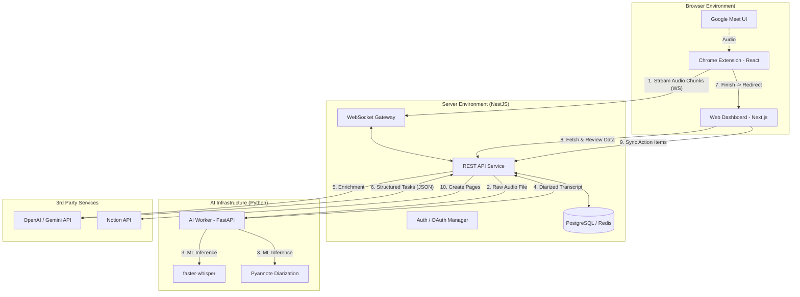

# System Architecture: AI Meeting Assistant (Kapter 2.0) - v2.1

Tài liệu này mô tả kiến trúc hệ thống cập nhật, tập trung vào mô hình đa nền tảng (Chrome Extension & Web Dashboard) để tối ưu hóa trải nghiệm người dùng.

## 1. Tổng quan Kiến trúc (System Overview)

Hệ thống được thiết kế theo mô hình **Multi-client Microservices**, tách biệt rõ ràng giữa các môi trường Capture, Management và Processing.

### Các thành phần chính:

1.  **Capture Client (Chrome Extension):** React/TS. Chuyên trách thu âm thanh từ Google Meet và truyền chunk về server qua WebSocket.
2.  **Management Client (Web App Dashboard):** Next.js. Nơi người dùng quản lý lịch sử, xem tóm tắt, chỉnh sửa Action Items và thực hiện đồng bộ Notion.
3.  **Orchestrator (Web Backend):** NestJS. Trạm trung chuyển dữ liệu, quản lý xác thực (Auth), quản lý Database và điều phối các task xử lý nặng.
4.  **AI Engine (Python Worker):** Core xử lý STT (Speech-to-Text) và Diarization (Phân biệt người nói).

---

## 2. Sơ đồ Kiến trúc (Architecture Diagram)

---

## 3. Luồng Xử lý & Đồng bộ (Data & Auth Flow)

### 3.1 Đồng bộ Xác thực (Cross-Domain Auth)

- Người dùng đăng nhập lần đầu tại **Web Dashboard** (Next.js). Token được lưu vào Cookie/LocalStorage.
- **Extension** sử dụng Content Script để truy xuất Token từ domain của Web Dashboard và lưu vào `chrome.storage.local`.
- Khi tham gia Google Meet, Extension dùng Token này để thiết lập kết nối WebSocket an toàn với Backend.

### 3.2 Luồng "Hand-off" (Extension to Web App)

1.  Khi người dùng bấm **Stop** trên Extension, Backend hoàn tất xử lý và sinh ra một `meeting_id`.
2.  Extension nhận `meeting_id` và tự động thực hiện lệnh `window.open("https://app.kapter.com/meeting/[meeting_id]")`.
3.  Người dùng được chuyển sang giao diện Web App màn hình lớn để thực hiện Review & Approve.

---

## 4. Công nghệ Sử dụng (Tech Stack Update)

| Thành phần            | Công nghệ                                          |
| :-------------------- | :------------------------------------------------- |
| **Capture Extension** | React, Vite, Chrome Extension API v3, TailwindCss  |
| **Web Dashboard**     | React, Vite, TailwindCSS, Shadcn/UI                |
| **Web Backend**       | NestJS, Socket.io, TypeORM                         |
| **AI Worker**         | Python, FastAPI, faster-whisper, Pyannote          |
| **Integrations**      | Notion API, OpenAI/Gemini SDK                      |

---

## 5. Cân nhắc Kỹ thuật (Technical Considerations)

- **State Persistence:** Sử dụng Redis để lưu trữ trạng thái "đang xử lý" của cuộc họp để Web App có thể hiển thị thanh progress bar theo thời gian thực.
- **Payload Size:** Chuyển audio qua WebSocket dưới dạng nhị phân (Binary) để giảm overhead so với Base64.
- **UX Consistency:** Thiết kế UI thống nhất giữa Widget của Extension và Dashboard trên Web App.
